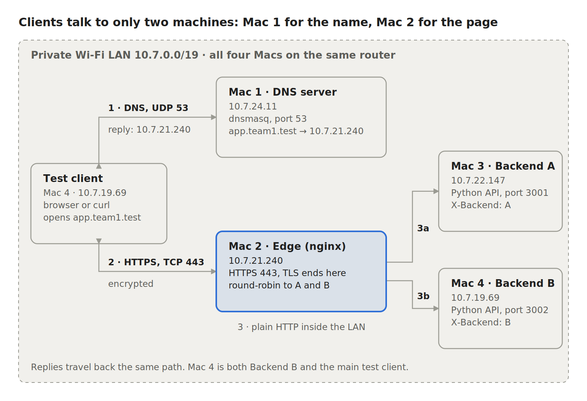
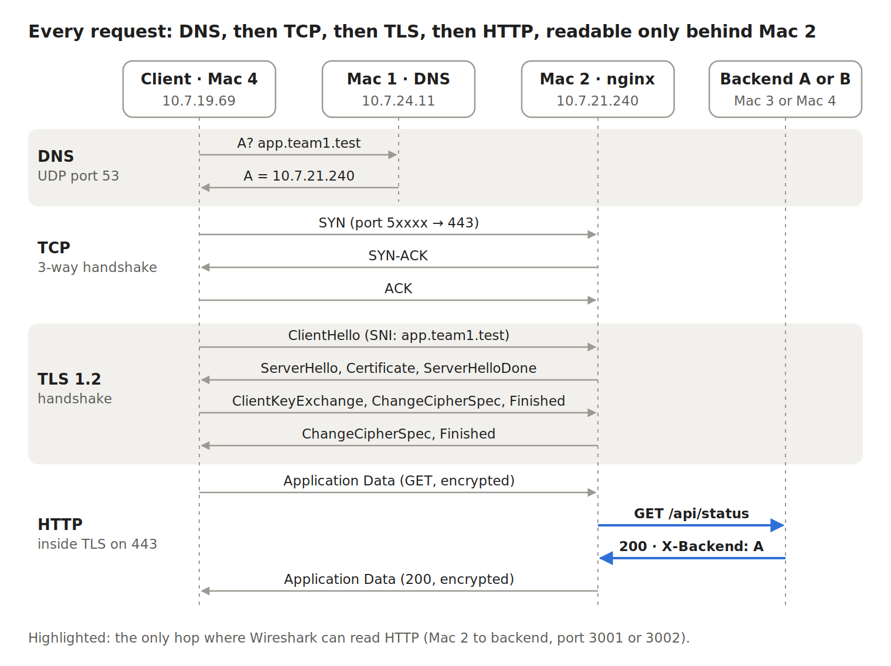

# Architecture - Private Network Service Platform (Phase 1)

## 1. Overview

A client types `https://app.team1.test`. The name is resolved by our own
DNS server (Mac 1), the HTTPS connection terminates at an nginx edge
(Mac 2), and nginx load-balances each request to one of two backends
(Mac 3 and Mac 4). Everything runs locally on four Macs on one Wi-Fi LAN,
with no cloud.

## 2. Machine roles and cloud equivalents

| Mac | Role | Runs | Cloud equivalent |
| --- | --- | --- | --- |
| Mac 1 (10.7.24.11) | Private DNS server + test client | dnsmasq, dig, curl | AWS Route 53 (managed DNS) |
| Mac 2 (10.7.21.240) | Edge reverse proxy + load balancer, TLS termination | nginx, server certificate | AWS ALB / GCP Load Balancer / CDN edge |
| Mac 3 (10.7.22.147) | Backend A | Python REST API, port 3001 | Application server instance (EC2) |
| Mac 4 (10.7.19.69) | Backend B + main test client | Python REST API, port 3002, curl, Wireshark | Application server instance (EC2) |

Full addressing details: [ip-service-inventory.md](ip-service-inventory.md)

## 3. Request flow

1. **DNS** - Mac 4 asks Mac 1 for `app.team1.test` (UDP, client ephemeral port -> 53). Mac 1 answers `10.7.21.240` with TTL 30.
2. **TCP** - Mac 4 opens a TCP connection to `10.7.21.240:443`: SYN -> SYN-ACK -> ACK.
3. **TLS** - ClientHello (SNI app.team1.test) -> ServerHello -> Certificate (signed by Team1 Local Root CA) -> key exchange -> Finished. Everything after this is encrypted.
4. **HTTP** - the GET request travels inside TLS (HTTP/2 by default, HTTP/1.1 also supported).
5. **Load balancing** - nginx decrypts the request and forwards it as plain HTTP to Backend A (10.7.22.147:3001) or Backend B (10.7.19.69:3002) in round-robin order.
6. The backend replies with `X-Backend: A` or `B`; nginx returns it to the client over the same TLS connection.

The client never learns the backend IP addresses. DNS only ever returns
Mac 2, and nginx chooses the backend.

## 4. Protocol layer mapping

| Protocol in this project | TCP/IP layer | OSI layer | Where it is shown |
| --- | --- | --- | --- |
| DNS | Application | 7 Application | `dig`, Wireshark `dns`, dnsmasq log |
| HTTP/1.1, HTTP/2 | Application | 7 Application | `curl -v`, browser DevTools |
| TLS 1.2 / 1.3 | Between Application and Transport | 5-6 Session/Presentation | Wireshark `tls.handshake` |
| TCP | Transport | 4 Transport | SYN / SYN-ACK / ACK on port 443 |
| UDP | Transport | 4 Transport | DNS on port 53 |
| IPv4 | Internet | 3 Network | 10.7.x.x addresses, `ping` |
| Wi-Fi (802.11) | Link | 2 Data link (+1 Physical) | MAC addresses in frame headers |

## 5. Design decisions

- **`.test` domain** - reserved for testing (RFC 6761); `.local` conflicts with macOS mDNS.
- **dnsmasq with `local=/team1.test/`** - our zone is never forwarded upstream; all other names are forwarded to 1.1.1.1 / 8.8.8.8, so the internet keeps working for clients.
- **Own root CA instead of a self-signed server certificate** - clients trust one root, and the server certificate carries the correct SANs. Validation is never skipped (no `curl -k`). See [../tls/certificate-setup.md](../tls/certificate-setup.md).
- **TLS terminates at the edge** - certificates live in one place; the edge-to-backend hop is plain HTTP inside the LAN (shown in `evidence/07_WIRESHARK/G9_plain_backend_hop.txt`).
- **Round-robin with passive health checks** - `proxy_next_upstream` retries a failed request on the other backend; `max_fails=1 fail_timeout=10s` keeps a dead backend out of rotation for 10 seconds.
- **Backends bind 0.0.0.0** - binding to 127.0.0.1 would make them unreachable from Mac 2.
- **Identical `/api/info` on both backends** - the ETag matches whichever backend answers, so conditional requests (304) work behind the load balancer.

## 6. Known single point of failure

The nginx edge on Mac 2 is the only entry point. If Mac 2 fails, DNS still
works but the service is unreachable. Phase 2 addresses this with a standby
edge and DNS-based cutover.
